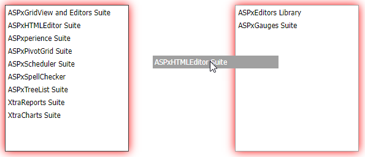

<!-- default badges list -->

<!-- default badges end -->

# List Box for ASP.NET Web Forms - How to drag and drop items from/to ASPxListBox using jQuery UI
<!-- run online -->
**[[Run Online]](https://codecentral.devexpress.com/128531537/)**
<!-- run online end -->

This example demonstrates how to use the [jQuery UI](https://jqueryui.com/) to implement drag-and-drop functionality between two [ASPxListBox](https://docs.devexpress.com/AspNet/DevExpress.Web.ASPxListBox) controls.

## Files to Review

* [Default.aspx](./CS/WebSite/Default.aspx) (VB: [Default.aspx](./VB/WebSite/Default.aspx))
